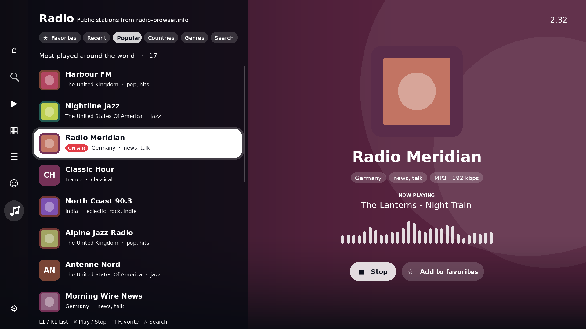
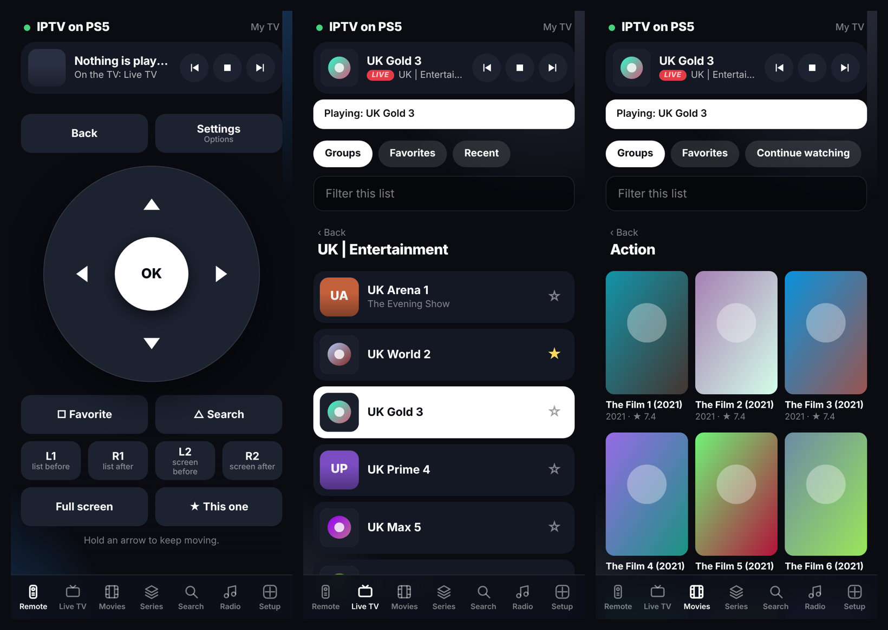
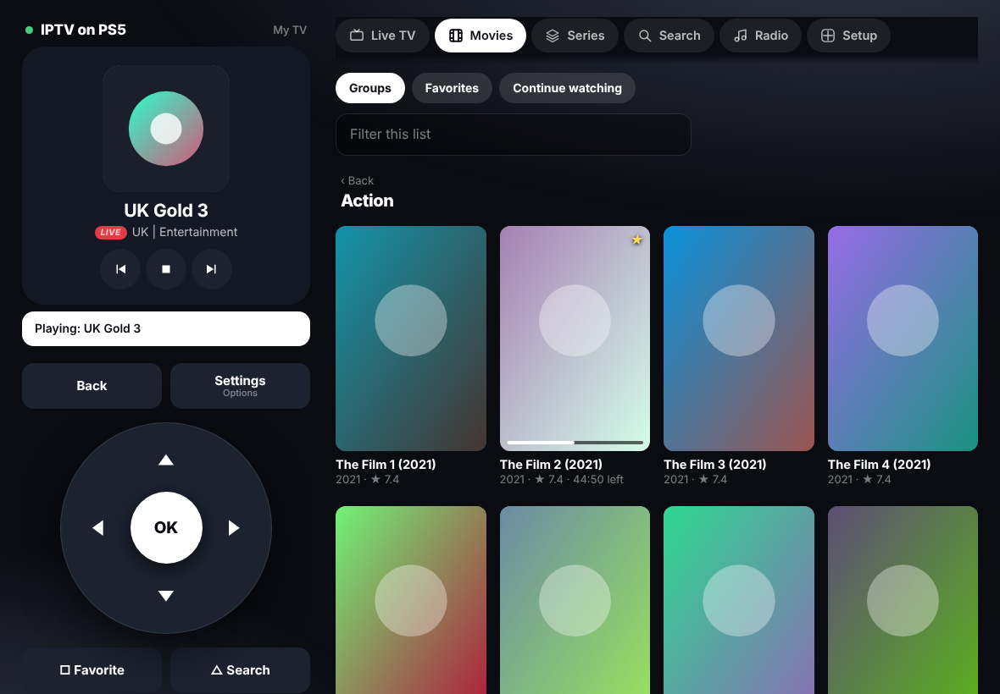

<div align="center">


# IPTV for PS5

**A native IPTV player for the PlayStation 5**

[](#requirements)
[](../../releases)
[](#how-the-source-is-laid-out)
[](LICENSE)

[Features](#features) · [Screenshots](#screenshots) · [Remote](#remote-your-phone-as-the-controller) · [Radio](#radio) · [Controls](#controls) · [Build](#build-and-install) · [Troubleshooting](#troubleshooting)

</div>

**IPTV for PS5** plays IPTV playlists on a PlayStation 5: M3U and M3U8 playlists, Xtream Codes accounts, and Stalker / Ministra portals. It has live TV with a programme guide and catch-up, movies and series with resume, search across everything, public radio stations, a remote control page for your phone, and two complete layouts to choose from.

It is written in C++ and draws its own interface with OpenGL, decoding video with FFmpeg. It is modelled on the desktop app [IPTVnator](https://github.com/4gray/iptvnator).

> ⚠️ **This app does not provide any playlists, channels or other content.** You supply your own. The only thing it can play without a playlist of yours is public radio, which it looks up in the community-run [Radio Browser](https://www.radio-browser.info) directory. The channel and station names and the pictures in the screenshots are invented, for demonstration only.

> [!IMPORTANT]
> This is an independent homebrew project. It is not affiliated with, endorsed by, or supported by Sony Interactive Entertainment or by the IPTVnator project. It needs a console that can already run homebrew.


## Features

**Playlists and sources**

- M3U / M3U8 playlists from a web address or a file 📂
- Xtream Codes accounts and Stalker / Ministra portals, with a MAC address per portal
- Several playlists side by side, each with its own favorites and history
- Saved copies of category lists, so the app opens at once and refreshes in the background
- 📱 Add playlists from a phone or computer, with a real keyboard ([see Remote](#remote-your-phone-as-the-controller))

**Live TV and guide**

- Groups gathered by country (UK, US, AR and so on), with one-press switching between countries
- Now and next on every channel, and a full guide grid of channels against hours 🗓️
- Catch-up: play back past programmes where the provider keeps them
- XMLTV guides for M3U playlists, plain or gzip-packed
- Favorites ⭐, recently watched, and hiding of a group, a whole country or a single channel, with an optional PIN

**Movies and series**

- Posters, year, rating, length, genres, plot and cast on each title's page
- Resume where you left off, continue watching, watched ticks
- The next episode plays by itself
- Trailers, where the provider gives a playable address
- 🔍 Search across live channels, movies and series at once

**Radio** 📻

- Public radio stations from the [Radio Browser](https://www.radio-browser.info) directory: the most played, by country, by genre, or searched by name
- Favorite and recently played stations, kept per profile
- The song now playing, when the station announces it
- A station carries on playing while you browse other screens

**Remote** 📱

- A page served by the console turns a phone or computer into the remote control: scan the QR code in Settings
- Every button of the controller, with arrows that repeat while held
- Browse live channels, movies and series (down to the episode) on the phone and tap one to play it on the TV
- Search channels, films and series, or radio stations, and play a result with a tap
- Type into the TV's on-screen keyboard from the phone
- Pause, stop, skip, next and previous for whatever is playing

**Playback**

- Software decoding up to 4K HEVC 10-bit
- HDR (PQ and HLG) tone-mapped for an ordinary screen
- Audio track and subtitle selection; text and picture-based subtitles; timing adjustment for both
- Picture fit (fit, zoom, stretch), smoothing for interlaced broadcasts, even film cadence
- DTS, TrueHD and FLAC sound with the optional FFmpeg rebuild in [`tools/`](tools)
- Sleep timer

**Interface**

- Two layouts: **TV style** (full-screen picture, side rail, white focus) and **Classic** (bar, tabs and columns)
- Home screen with continue watching and your favorites, grouped by country
- Colour themes, built in and loadable from files 🎨
- Profiles, each with its own favorites, history and hidden groups
- An on-screen pointer driven by the left stick, with adjustable speed, size and shape
- Optional menu sounds

## Screenshots

| Home | Live TV |
| --- | --- |
|  |  |
| **Movies** | **Title page** |
|  |  |
| **Guide grid** | **Remote: the code to scan** |
|  |  |
| **Radio** | **Remote: the page on a phone** |
|  |  |
| **Remote: on a tablet or computer** | |
|  | |
| **Themes and layout** | **Classic layout** |
|  |  |

## Remote: your phone as the controller

The console serves a small web page on your home network. Any phone, tablet or computer on the same network can open it; nothing needs installing.

1. Open **Settings → Remote** on the console. It shows a QR code and an address such as `http://192.168.1.20:8080/?k=abc234`.
2. Scan the code with a phone's camera, or type the whole address into a browser.

The page has seven tabs:

| Tab | What it does |
| --- | --- |
| **Remote** | The controller's buttons: arrows (hold to repeat), OK, Back, Settings, □, △, L1 / R1, L2 / R2, plus skip buttons for films and "full screen". |
| **Live TV** | Your groups, favorites and recently watched channels. Tap a group to open it, tap a channel to play it on the TV. A filter box narrows long lists. |
| **Movies** | Categories, favorites and part-watched films. Tap a film to play it; it resumes where it was left. |
| **Series** | Categories and favorites. Tap a series to list its episodes, tap an episode to play it; the next one follows. |
| **Search** | Channels, films and series by name. Tap a result to play it; a series opens its episodes on the TV. |
| **Radio** | Favorite, recent and popular stations, and a search by name. Tap one to listen. |
| **Setup** | Add a playlist with a real keyboard (M3U address, Xtream Codes, Stalker / Ministra), send an M3U file, save or restore a backup. |

Lists show channel logos and film posters, as the TV does. On a tablet or computer the remote and what is playing stay at the left while the lists fill the rest, and a computer's arrow keys, Enter and Esc work as the remote. A star beside a channel or station makes it a favorite; tapping a film opens a sheet to play, resume or start it over.

A bar at the top always shows what is playing, with previous, pause, stop and next. Whenever the keyboard is open on the TV, the page offers a box to type into instead.

> [!NOTE]
> The page is served while the app is running. The address ends in a six-character key, and nothing is answered without it, so only someone who can see the code on the television can use the page. It is still meant for your own home network: the connection is not encrypted. **Settings → Remote** can switch the page off (✕) or make a new key (□), which shuts out every device that had the old address.

## Radio

The **Radio** screen (the last entry before Settings) plays public radio stations. They are not part of the app and not part of any playlist: lists are fetched, when you open the screen, from [Radio Browser](https://www.radio-browser.info), a free directory kept by volunteers.

- **Popular**, **Countries**, **Genres** and **Search** choose what is listed; **Favorites** (□ on a station) and **Recent** are your own.
- ✕ plays a station, and stops it again. It keeps playing while you look at other screens, until you stop it or start something else.
- Stations that send MP3 or AAC sound are listed; the few that use other formats are left out.

## Controls

| Button | Action |
| --- | --- |
| D-pad / left stick | Move, or steer the pointer |
| ✕ Cross | Choose, play |
| ○ Circle | Back |
| □ Square | Add to favorites (channels, titles, radio stations); clear the screen during playback |
| △ Triangle | Filter the list; start a new search; jump to now in the guide |
| L1 / R1 | Next country or category; next list on Radio; three hours in the guide; seek five minutes |
| L2 / R2 | Switch main screen (Classic layout) |
| Right stick | Scroll |
| OPTIONS | Settings |

## Requirements

- A PlayStation 5 able to run homebrew, with an FTP server reachable on the network
- A Linux machine to build on
- The PS5 homebrew toolchain and support kit this project builds against (see below)

## Build and install

The build script expects the toolchain in `~/ps5-workspace/es-port` and the support kit in `~/Downloads/es-ps5-kit`. The paths are set at the top of [`build.sh`](build.sh).

```bash
git clone <this repository> ~/ps5-workspace/iptv-ps5
cd ~/ps5-workspace/iptv-ps5
bash build.sh
make -C build/title deploy PS5_HOST=<console address>
```

`build.sh` compiles the app, links it, and assembles the title folder. `deploy` sends it to the console over FTP.

For DTS, TrueHD and FLAC sound and picture-based subtitles, rebuild FFmpeg once with the extra formats, then build the app again:

```bash
bash tools/ffmpeg-more-formats.sh
```

For radio, FFmpeg needs its readers for plain MP3 and AAC streams. This checks, and rebuilds only if they are missing:

```bash
bash tools/ffmpeg-radio-formats.sh
```

## How the source is laid out

| Path | What it is |
| --- | --- |
| `src/main.cpp` | The list of the app's parts, in order |
| `src/app/` | The app itself: screens, input, state ([details](src/app/README.md)) |
| `src/gfx.*` | Drawing: shapes, text, pictures, video |
| `src/player.*` | Playback: decoding, sound, subtitles, timing |
| `src/sources.*` | Playlists and providers: M3U, Xtream, Stalker; guide, search, catch-up |
| `src/net.*`, `src/json.*`, `src/playlist.*` | Downloads, JSON reading, M3U reading |
| `src/logos.*`, `src/images.*`, `src/cursors.*` | Logos and posters, picture decoding, pointer files |
| `src/webadd.*`, `src/webpage.h`, `src/qr.*` | The Remote page: its server, the page itself, and its QR code |
| `src/radio.*` | The radio directory (Radio Browser) |
| `src/xmltv.*` | Guides for M3U playlists, with a gzip unpacker |
| `sce_sys/` | The console's icon and background artwork |

On the console, everything the app keeps is in `/data/iptv/`: playlists, settings, favorites and history (per playlist and per profile), `themes/` for extra colour themes, `pointers/` for custom pointers, `cache/` for saved copies, and `iptv-log.txt`.

## Troubleshooting

**A film plays with no sound.**
It probably uses DTS or TrueHD. Run `tools/ffmpeg-more-formats.sh`, then build and deploy again.

**The clock or guide times are an hour or more out.**
Set your time zone in **Settings → Pointer → Clock**.

**The Remote tab says it is not available.**
The console did not let the app accept connections. Playlists can still be added on the Playlists tab, or sent by FTP to `/data/iptv/playlists/`.

**The phone says "This address needs the key".**
The address was typed without its ending, or a new key was made since. Scan the code in **Settings → Remote** again.

**Every radio station fails with "Could not open the stream".**
The FFmpeg the app was built with may lack the readers for plain MP3 and AAC streams. Run `bash tools/ffmpeg-radio-formats.sh` (it checks first, and rebuilds only if they are missing), then build and deploy again. A single station failing is usually that station being off the air.

**The Radio lists do not load.**
The console needs internet access to reach the directory. The log names the servers that were tried.

**Nothing is marked for catch-up in the guide.**
Catch-up depends on the provider. If no programme shows the ↺ mark, the provider is not offering it for that channel.

**The app shows old groups after the provider changed them.**
Press **Reload** in the top bar (Classic layout), which asks the server afresh.

**Something else.**
The app writes a log to `/data/iptv/iptv-log.txt` on the console. It records what was asked of the server and what came back, and is the first thing to look at.

## Disclaimer

**IPTV for PS5 does not provide any playlists or other digital content.** It is a player. What you watch with it, and your right to watch it, are your own responsibility.

The radio stations are listed by Radio Browser, not by this project, which neither hosts nor chooses them.

## Credits

- Modelled on [IPTVnator](https://github.com/4gray/iptvnator) by 4gray. This is a separate project with its own code, name and icon.
- Built with [FFmpeg](https://ffmpeg.org), [SDL2](https://www.libsdl.org), [FreeType](https://freetype.org) and [curl](https://curl.se).
- Radio stations come from [Radio Browser](https://www.radio-browser.info), a community directory.
- The pointer files in `pointers/` were drawn for this app.

## License

Released under the [MIT License](LICENSE).
