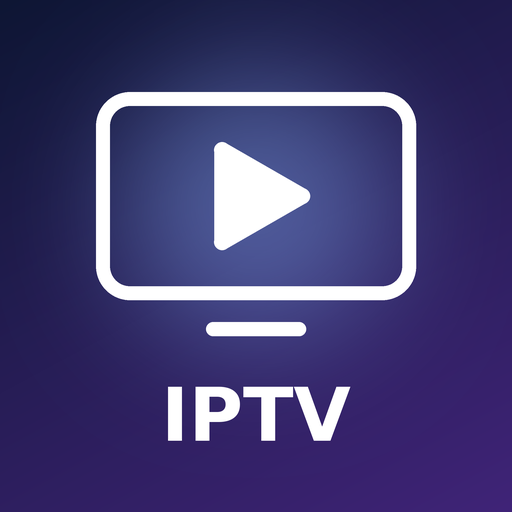
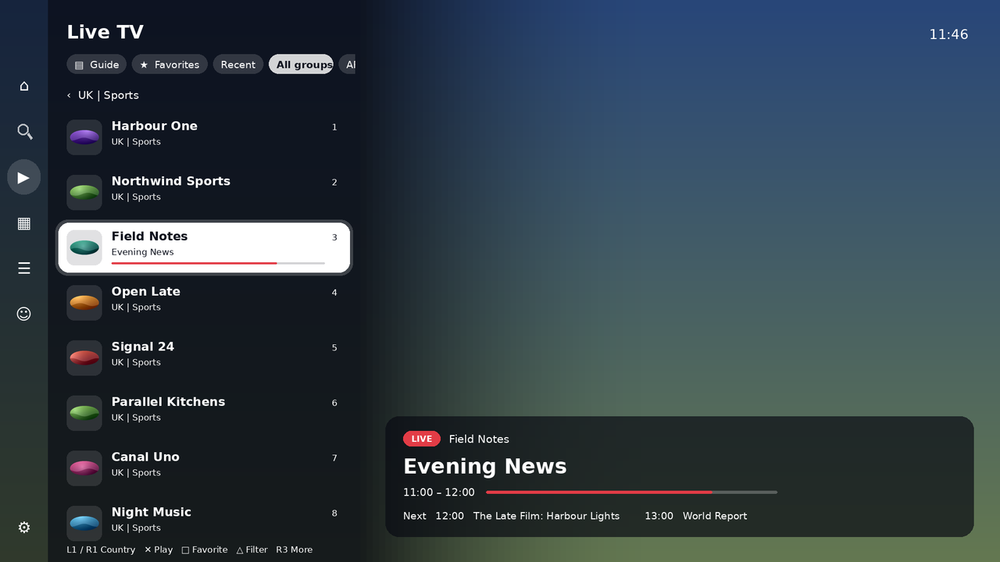
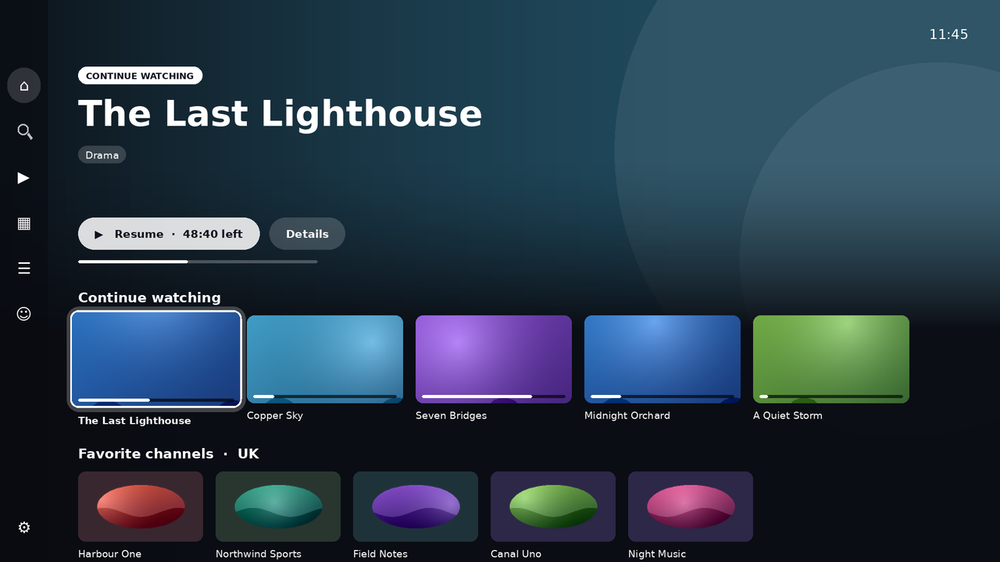
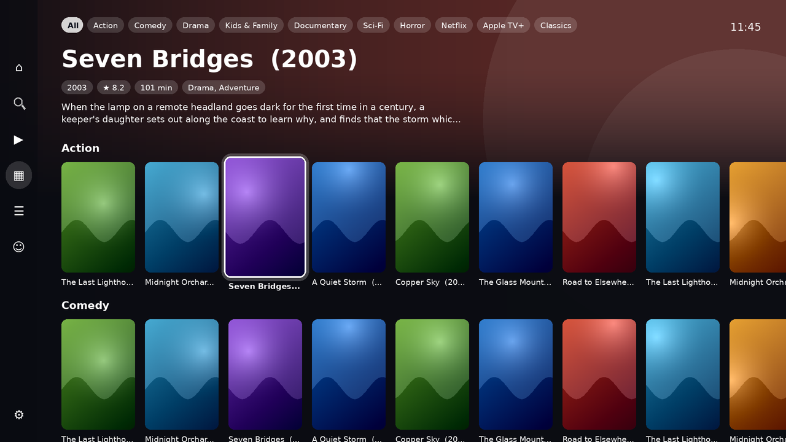
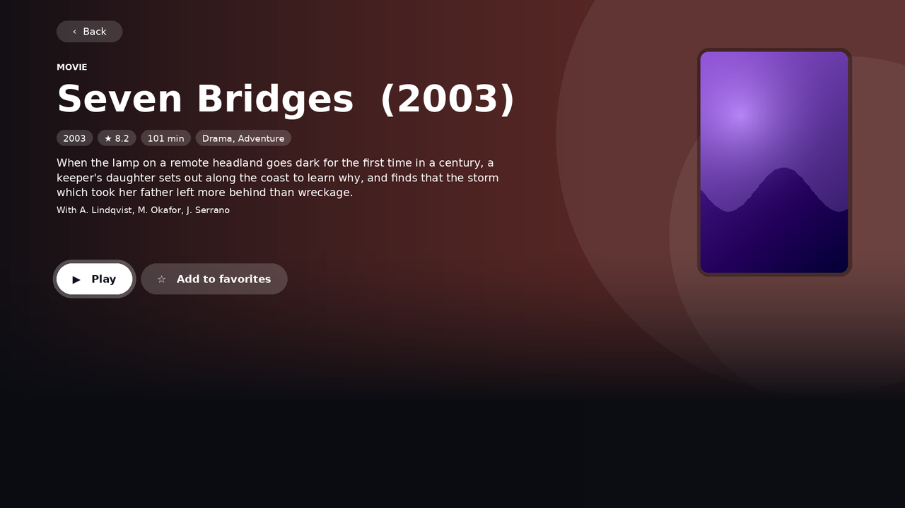
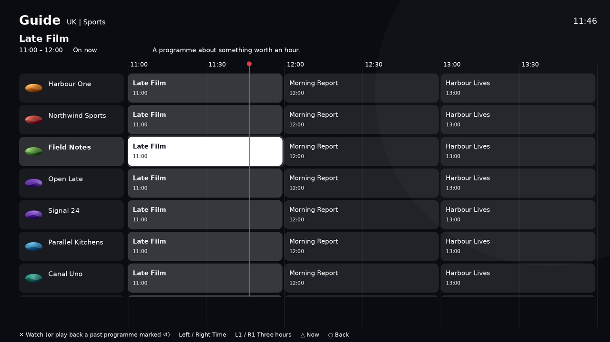
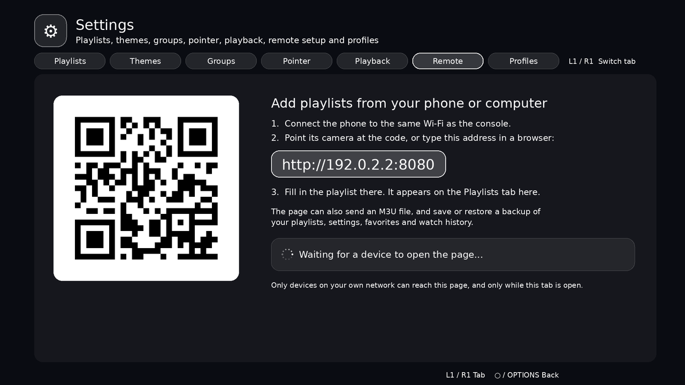
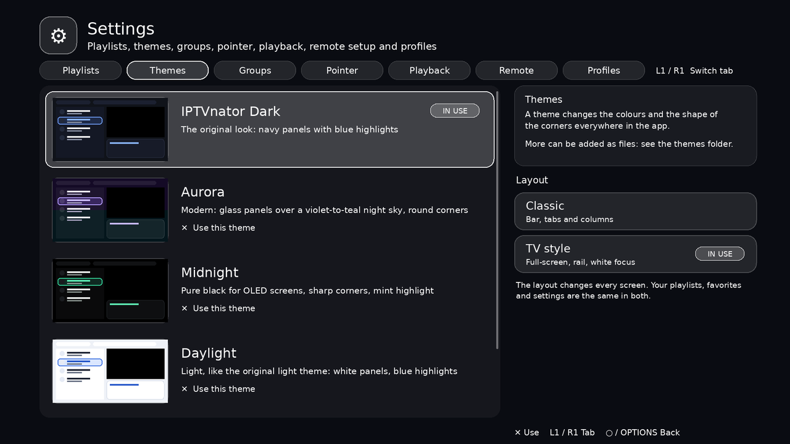
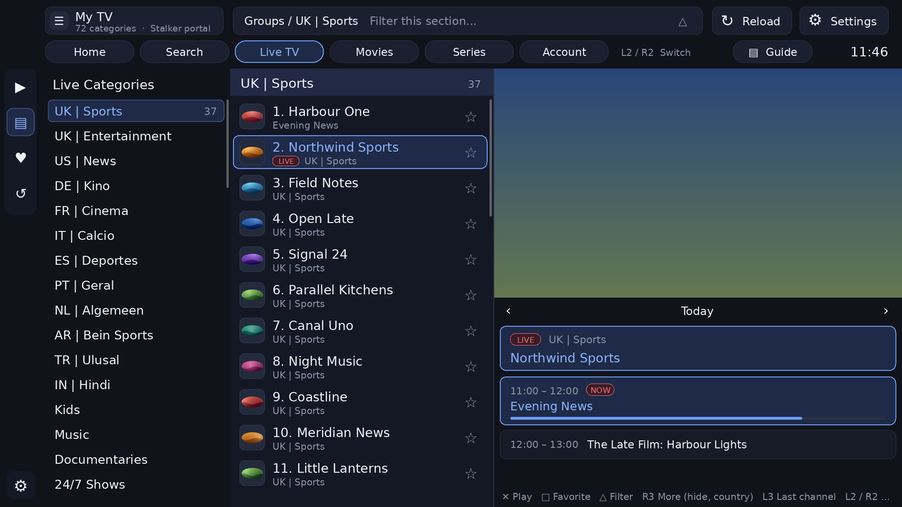

<div align="center">



# IPTV for PS5

**A native IPTV player for the PlayStation 5**

[](#requirements)
[](../../releases)
[](#how-the-source-is-laid-out)
[](LICENSE)

[Features](#features) · [Screenshots](#screenshots) · [Remote setup](#remote-setup) · [Controls](#controls) · [Build](#build-and-install) · [Troubleshooting](#troubleshooting)

</div>

**IPTV for PS5** plays IPTV playlists on a PlayStation 5: M3U and M3U8 playlists, Xtream Codes accounts, and Stalker / Ministra portals. It has live TV with a programme guide and catch-up, movies and series with resume, search across everything, and two complete layouts to choose from.

It is written in C++ and draws its own interface with OpenGL, decoding video with FFmpeg. It is modelled on the desktop app [IPTVnator](https://github.com/4gray/iptvnator).

> ⚠️ **This app does not provide any playlists, channels or other content.** You supply your own. The channel names and pictures in the screenshots are invented, for demonstration only.

> [!IMPORTANT]
> This is an independent homebrew project. It is not affiliated with, endorsed by, or supported by Sony Interactive Entertainment or by the IPTVnator project. It needs a console that can already run homebrew.



## Features

**Playlists and sources**

- M3U / M3U8 playlists from a web address or a file 📂
- Xtream Codes accounts and Stalker / Ministra portals, with a MAC address per portal
- Several playlists side by side, each with its own favorites and history
- Saved copies of category lists, so the app opens at once and refreshes in the background
- 📱 **Remote setup:** add playlists from a phone or computer by scanning a QR code ([see below](#remote-setup))

**Live TV and guide**

- Groups gathered by country (UK, US, AR and so on), with one-press switching between countries
- Now and next on every channel, and a full guide grid of channels against hours 🗓️
- Catch-up: play back past programmes where the provider keeps them
- XMLTV guides for M3U playlists, plain or gzip-packed
- Favorites ⭐, recently watched, and hiding of a group, a whole country or a single channel, with an optional PIN

**Movies and series**

- Posters, year, rating, length, genres, plot and cast on each title's page
- Resume where you left off, continue watching, watched ticks
- The next episode plays by itself
- Trailers, where the provider gives a playable address
- 🔍 Search across live channels, movies and series at once

**Playback**

- Software decoding up to 4K HEVC 10-bit
- HDR (PQ and HLG) tone-mapped for an ordinary screen
- Audio track and subtitle selection; text and picture-based subtitles; timing adjustment for both
- Picture fit (fit, zoom, stretch), smoothing for interlaced broadcasts, even film cadence
- DTS, TrueHD and FLAC sound with the optional FFmpeg rebuild in [`tools/`](tools)
- Sleep timer

**Interface**

- Two layouts: **TV style** (full-screen picture, side rail, white focus) and **Classic** (bar, tabs and columns)
- Home screen with continue watching and your favorites, grouped by country
- Colour themes, built in and loadable from files 🎨
- Profiles, each with its own favorites, history and hidden groups
- An on-screen pointer driven by the left stick, with adjustable speed, size and shape
- Optional menu sounds

## Screenshots

| Home | Live TV |
| --- | --- |
|  |  |
| **Movies** | **Title page** |
|  |  |
| **Guide grid** | **Remote setup** |
|  |  |
| **Themes and layout** | **Classic layout** |
|  |  |

## Remote setup

Typing long addresses with a controller is slow, so the console can serve a small web page on your home network.

1. Open **Settings → Remote** on the console. It shows a QR code and an address such as `http://192.168.1.20:8080`.
2. Scan the code with a phone, or type the address into any browser on the same network.
3. On the page you can:
   - **Add a playlist** with a real keyboard: an M3U web address, an Xtream Codes account, or a Stalker / Ministra portal
   - **Send an M3U file** from the device to the console
   - **Save a backup** of playlists, settings, favorites, profiles, hidden groups and watch history as one file, and **restore** it later
   - See the playlists already on the console

> [!NOTE]
> The page is served only while the Remote tab is open, and only to devices on the same network. It has no password, so anyone on that network can use it during that time.

## Controls

| Button | Action |
| --- | --- |
| D-pad / left stick | Move, or steer the pointer |
| ✕ Cross | Choose, play |
| ○ Circle | Back |
| □ Square | Add to favorites; clear the screen during playback |
| △ Triangle | Filter the list; start a new search; jump to now in the guide |
| L1 / R1 | Next country or category; three hours in the guide; seek five minutes |
| L2 / R2 | Switch main screen (Classic layout) |
| Right stick | Scroll |
| OPTIONS | Settings |

## Requirements

- A PlayStation 5 able to run homebrew, with an FTP server reachable on the network
- A Linux machine to build on
- The PS5 homebrew toolchain and support kit this project builds against (see below)

## Build and install

The build script expects the toolchain in `~/ps5-workspace/es-port` and the support kit in `~/Downloads/es-ps5-kit`. The paths are set at the top of [`build.sh`](build.sh).

```bash
git clone <this repository> ~/ps5-workspace/iptv-ps5
cd ~/ps5-workspace/iptv-ps5
bash build.sh
make -C build/title deploy PS5_HOST=<console address>
```

`build.sh` compiles the app, links it, and assembles the title folder. `deploy` sends it to the console over FTP.

For DTS, TrueHD and FLAC sound and picture-based subtitles, rebuild FFmpeg once with the extra formats, then build the app again:

```bash
bash tools/ffmpeg-more-formats.sh
```

## How the source is laid out

| Path | What it is |
| --- | --- |
| `src/main.cpp` | The list of the app's parts, in order |
| `src/app/` | The app itself: screens, input, state ([details](src/app/README.md)) |
| `src/gfx.*` | Drawing: shapes, text, pictures, video |
| `src/player.*` | Playback: decoding, sound, subtitles, timing |
| `src/sources.*` | Playlists and providers: M3U, Xtream, Stalker; guide, search, catch-up |
| `src/net.*`, `src/json.*`, `src/playlist.*` | Downloads, JSON reading, M3U reading |
| `src/logos.*`, `src/images.*`, `src/cursors.*` | Logos and posters, picture decoding, pointer files |
| `src/webadd.*`, `src/qr.*` | The Remote page and its QR code |
| `src/xmltv.*` | Guides for M3U playlists, with a gzip unpacker |
| `sce_sys/` | The console's icon and background artwork |

On the console, everything the app keeps is in `/data/iptv/`: playlists, settings, favorites and history (per playlist and per profile), `themes/` for extra colour themes, `pointers/` for custom pointers, `cache/` for saved copies, and `iptv-log.txt`.

## Troubleshooting

**A film plays with no sound.**
It probably uses DTS or TrueHD. Run `tools/ffmpeg-more-formats.sh`, then build and deploy again.

**The clock or guide times are an hour or more out.**
Set your time zone in **Settings → Pointer → Clock**.

**The Remote tab says it is not available.**
The console did not let the app accept connections. Playlists can still be added on the Playlists tab, or sent by FTP to `/data/iptv/playlists/`.

**Nothing is marked for catch-up in the guide.**
Catch-up depends on the provider. If no programme shows the ↺ mark, the provider is not offering it for that channel.

**The app shows old groups after the provider changed them.**
Press **Reload** in the top bar (Classic layout), which asks the server afresh.

**Something else.**
The app writes a log to `/data/iptv/iptv-log.txt` on the console. It records what was asked of the server and what came back, and is the first thing to look at.

## Disclaimer

**IPTV for PS5 does not provide any playlists or other digital content.** It is a player. What you watch with it, and your right to watch it, are your own responsibility.

## Credits

- Modelled on [IPTVnator](https://github.com/4gray/iptvnator) by 4gray. This is a separate project with its own code, name and icon.
- Built with [FFmpeg](https://ffmpeg.org), [SDL2](https://www.libsdl.org), [FreeType](https://freetype.org) and [curl](https://curl.se).
- The pointer files in `pointers/` were drawn for this app.

## License

Released under the [MIT License](LICENSE).
